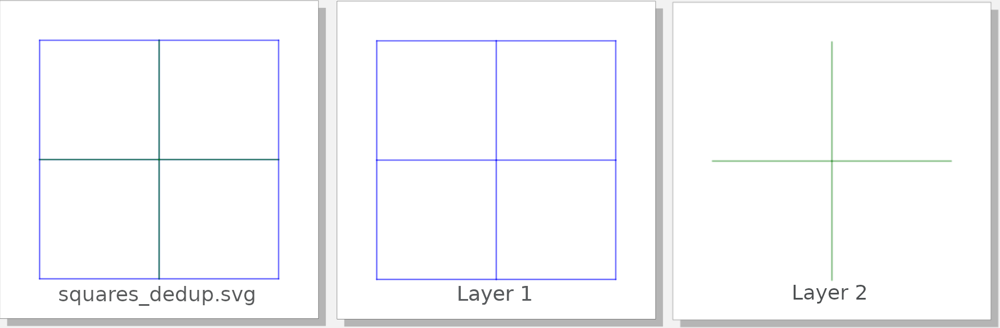
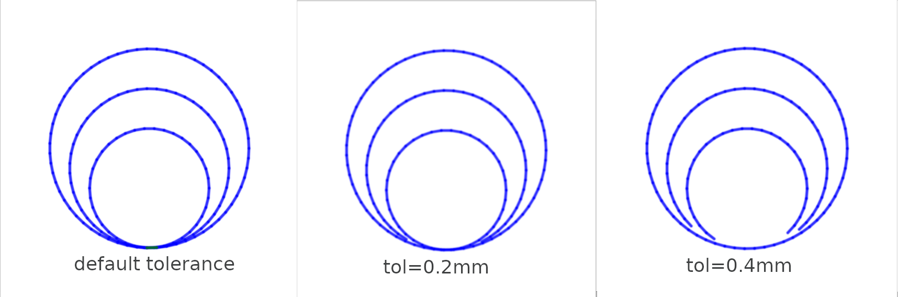

# deduplicate

[`vpype`](https://github.com/abey79/vpype) plug-in to remove overlapping lines in SVG files.


## Usage

```
Usage: vpype deduplicate [OPTIONS]

  Remove duplicate lines.

Options:
  -t, --tolerance LENGTH  Max distance between points to consider them equal
                          (default: 0.01mm)
  -p, --progress-bar      (flag) Display a progress bar
  -l, --layer LAYERS      Target layer(s) (defaul: 'all')
  -k, --keep-duplicates   (flag) Keep removed duplicates in a separate layer
  --help                  Show this message and exit.
```


## Examples

Basic usage : `vpype read file.svg deduplicate write output.svg`

You can keep removed lines in a separate layer with `-k` flag:

```
vpype read squares.svg deduplicate -k write squares_dedup.svg
```




The `-t` option controls the tolerance, which is the maximum distance 2 points are considered equal.

Here is what `vpype read tangent_circles.svg deduplicate -k -t 0.2mm show` outputs with different tolerances:




## Installation

See the [installation instructions](https://vpype.readthedocs.io/en/stable/install.html) for information on how
to install `vpype`.


### Existing `vpype` installation

Use this method if you have an existing `vpype` installation (typically in an existing virtual environment) and you
want to make this plug-in available. You must activate your virtual environment beforehand.

```bash
$ pip install git+https://github.com/LoicGoulefert/deduplicate.git#egg=deduplicate
```

Check that your install is successful:

```
$ vpype --help
Usage: vpype [OPTIONS] COMMAND1 [ARGS]... [COMMAND2 [ARGS]...]...

Options:
  -v, --verbose
  -I, --include PATH  Load commands from a command file.
  --help              Show this message and exit.

Commands:
[...]
  Plugins:
    deduplicate
[...]
```

### Stand-alone installation

Use this method if you need to edit this project. First, clone the project:

```bash
$ git clone https://github.com/LoicGoulefert/deduplicate.git
$ cd deduplicate
```

Create a virtual environment:

```bash
$ python3 -m venv venv
$ source venv/bin/activate
$ pip install --upgrade pip
```

Install `deduplicate` and its dependencies (including `vpype`):

```bash
$ pip install -e .
```

Check that your install is successful:

```
$ vpype --help
Usage: vpype [OPTIONS] COMMAND1 [ARGS]... [COMMAND2 [ARGS]...]...

Options:
  -v, --verbose
  -I, --include PATH  Load commands from a command file.
  --help              Show this message and exit.

Commands:
[...]
  Plugins:
    deduplicate
[...]
```


## License

See the [LICENSE](LICENSE) file for details.
